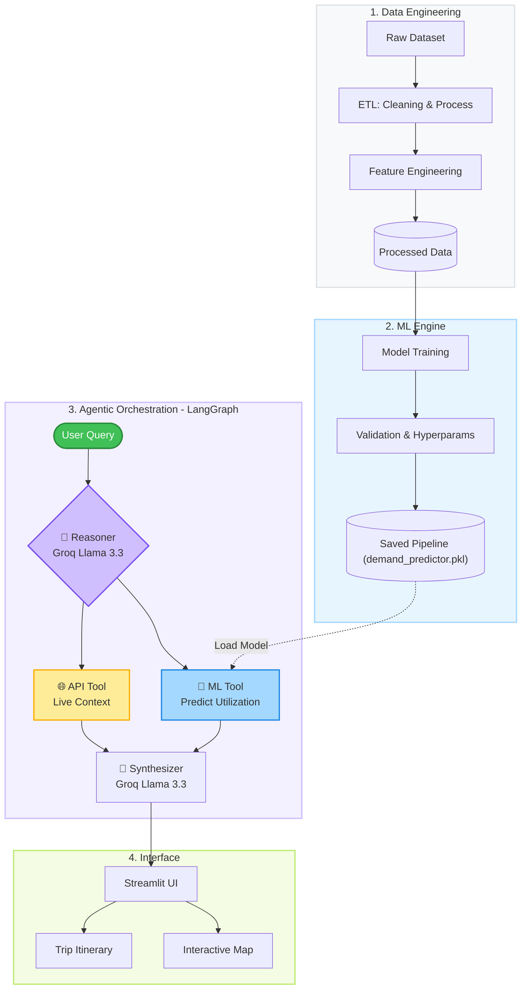

# Intelligent EV Charging Demand Prediction & Agentic Trip Planner

**Project 15 | End-Sem Submission | Milestone 2 — Agentic AI**


## 📌 Project Overview

This project builds an **AI-driven analytics and planning system** for electric vehicle (EV) infrastructure.

- **Milestone 1 (Mid-Sem):** Classical ML model (Random Forest) to predict EV charging station utilization.
- **Milestone 2 (End-Sem):** Agentic AI workflow using **LangGraph** that combines LLM reasoning (via Groq), the trained ML model, and live data APIs into a **Smart EV Trip & Charging Planner**.

### The Scenario

> An EV driver asks: *"I'm driving to New York this Friday at 5 PM. I have a Level 2 charger. Where and when should I charge to avoid traffic and high fees?"*
>
> The system processes this through a 4-node agentic pipeline and returns a personalized trip itinerary with optimal charging windows, wait time forecasts, and cost-saving tips.

## 🧠 LangGraph Architecture

The agentic workflow is built as a **compiled LangGraph state machine** using a multi-node architecture that mimics human trip-planning logic:



| Node | Role | Technology |
|------|------|-----------|
| 🧠 **Reasoner** | Parses natural language into structured trip parameters (city, time, charger type, etc.) | Groq (Llama 3.3 70B) |
| 🤖 **ML Tool** | Runs the trained Random Forest model to predict utilization rate and estimated wait time | Scikit-Learn Pipeline (`demand_predictor.pkl`) |
| 🌐 **API Tool** | Fetches live traffic conditions, weather advisories, station availability, and electricity pricing | External APIs (Simulated for demo) |
| 📝 **Synthesizer** | Combines all data into a personalized, actionable trip itinerary with cost optimization | Groq (Llama 3.3 70B) |

**State flows** through a `TypedDict` that accumulates data at each node, providing full transparency into the agent's reasoning process.

## 🚀 Features

### Milestone 1 — ML Dashboard
1. **Custom Data Pipeline:** Automated cleaning, time-series feature engineering, and deduplication.
2. **Optimized Inference Engine:** Scikit-Learn `Pipeline` with `ColumnTransformer` for sub-second prediction.
3. **Interactive Dashboard:** Streamlit UI with dynamic charts, demand drivers, and city-level analytics.

### Milestone 2 — Agentic AI Trip Planner
4. **Natural Language Interface:** Chat-based UI — ask trip planning questions in plain English.
5. **LangGraph State Machine:** 4-node agentic workflow with full reasoning transparency.
6. **ML Model Integration:** The Random Forest model is invoked as a tool within the agent pipeline.
7. **Live Data Fusion:** Traffic, weather, and pricing context enriches the ML prediction.
8. **Personalized Itineraries:** LLM synthesizer generates actionable trip plans based on all gathered data.

## 🛠️ Technology Stack

- **Language:** Python 3.12
- **ML Framework:** Scikit-Learn (Pipeline, RandomForestRegressor)
- **Agentic Framework:** LangGraph, LangChain
- **LLM Provider:** Groq (Llama 3.3 70B via `langchain-groq`)
- **Data Processing:** Pandas, NumPy
- **UI Framework:** Streamlit
- **Deployment:** Streamlit Community Cloud / HuggingFace Spaces

## 📂 Project Structure

```
EV_Charging_Intelligence/
├── data/
│   ├── raw/                      # Original dataset
│   └── processed/                # Cleaned data for training
├── models/
│   └── demand_predictor.pkl      # Trained Random Forest model
├── report/
│   ├── report.tex                # LaTeX report (Milestone 1 + 2)
│   └── model_evaluation_report.md
├── src/
│   ├── app.py                    # Streamlit app (ML Dashboard + AI Planner)
│   ├── agent.py                  # LangGraph agentic workflow (4 nodes)
│   ├── data_preprocessing.py     # ETL script
│   ├── model_trainer.py          # Model training script
│   ├── model_trainer_lite.py     # Lightweight model trainer
│   └── evaluate_model.py         # Evaluation metrics
├── .env.example                  # API key template
├── requirements.txt              # All dependencies
└── README.md                     # This file
```

### 5. AI Reasoning & Groq Integration

The pipeline leverages **Groq (Llama 3.3 70B)** due to its ultra-low latency, making real-time interactive multi-step reasoning feasible. It provides structed extraction in the "Reasoner" node and conversational synthesis in the final step.

## ⚙️ Installation & Setup

### 1. Clone the repository
```bash
git clone https://github.com/jaiswalsachin49/EV_Charging_Intelligence.git
cd EV_Charging_Intelligence
```

### 2. Create a virtual environment
```bash
python -m venv venv
source venv/bin/activate  # On Windows: venv\Scripts\activate
```

### 3. Install dependencies
```bash
pip install -r requirements.txt
```

### 4. Set up API Key (Required for AI Trip Planner)
```bash
cp .env.example .env
# Edit .env and add your Groq API key
# Get a free key from: https://console.groq.com/keys
```

Or enter the key directly in the Streamlit sidebar when using the AI Trip Planner.

### 5. Train the ML model

**Git LFS & Model Size Note:** The high-fidelity model (1.47 GB) is too large for standard GitHub hosting. By default, a **Lite Model** (`< 100MB`) is included in the repository for immediate testing. 

- To re-train the **Lite Model** (quick, low memory):
  ```bash
  python src/model_trainer_lite.py
  ```
- To train the **Full High-Fidelity Model** (requires more memory and time):
  ```bash
  python src/model_trainer.py
  ```

### 6. Run the application
```bash
streamlit run src/app.py
```

## 📊 Model Performance (Milestone 1)

The Random Forest model demonstrates strong predictive capability:

- **R-Squared (R²):** 0.9045
- **RMSE:** 0.0926
- **MAE:** 0.0634

## 🧪 Example Queries for the AI Trip Planner

```
"I'm driving to New York this Friday at 5 PM. I have a Level 2 charger.
 Where and when should I charge to avoid traffic and high fees?"

"Planning a weekend trip to Chicago, leaving Saturday morning.
 DC Fast charger. What's the best charging strategy?"

"Need to get to San Francisco by 9 AM Monday. It's going to rain.
 Should I charge tonight or on the way?"
```

## 🌐 Deployment 

- **Live Demo:** [https://ev-intelligence-charging-predictor.streamlit.app/](https://ev-intelligence-charging-predictor.streamlit.app/)

---

## 👥 Team & Technical Integrity

- **Batch:** Section - C
- **Team Members:**
  - Sachin Jaiswal: ML Model + LangGraph Agent Architecture
  - Ayush Tiwari: Data Cleaning & Presentation
  - Sibtain Ahmed Qureshi: Report & Documentation
  - Md. Sajjan: Frontend UI Development
